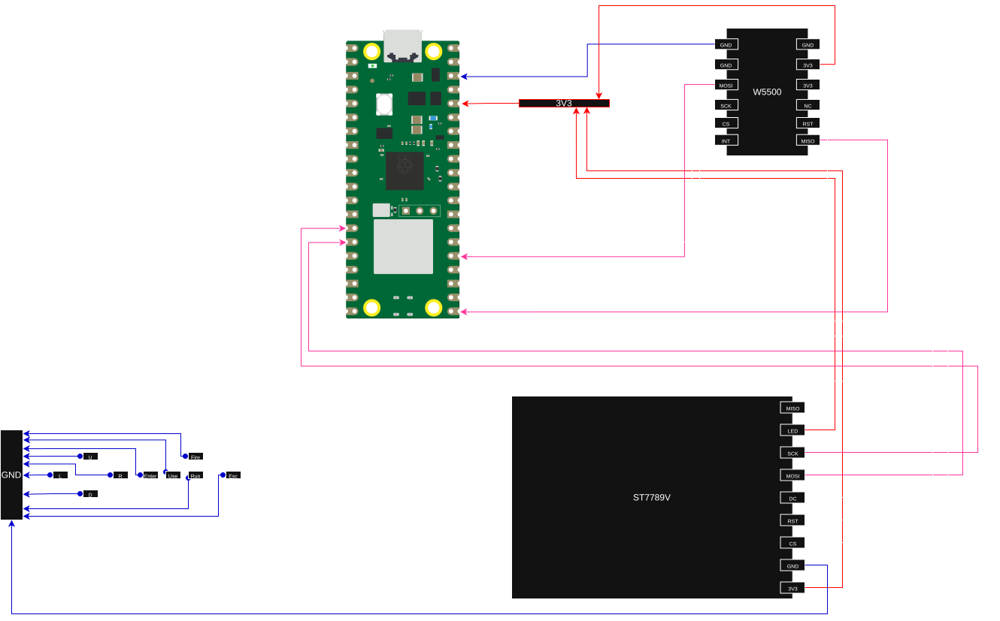

# DOOM 1993 on Redmi AC2100

This guide documents how I ported original DOOM 1993 to the AC2100 router.  
Even though this was tested only on that specific router and my personal laptop,  
every linux-based device with an Ethernet controller should be able to run it.  

[](https://github.com/anhol0/redmidoom/blob/main/images/out.mp4)

## Architecture

The project relies on a handmade network framebuffer and a Raspberry Pi Pico  
for input polling and image display.  

I used W5500 based Ethernet module for communication between the router and the pico  
as well as ST7789V based display module without anti-tearing pin for image output.  
Links to two components that I used in the project will be in the bottom of this document.  

### Pico side implementation

W5500 module is connected to the SPI0 while ST7789V is connected to SPI1 so thei don'e share  
the same bus. Buttons connect directly to the GP0-8 pins on the Pico board. Though, configuration  
may be changed if you want to alter connections.  

W5500 runs at 40MHz and ST7789V runs at 62.5MHz. W5500 runs at lower speed because at 62.5MHz  
functionality was unstable.  

If you desire to run DOOM on your Linux based device without a display or input methods  
here is the complete wiring diagram between Pico and all other components.

Wiring diagram is as follows:

| Device | Device pin / control | Pico connection | Pico physical pin |
|---|---|---|---:|
| W5500 | VCC | 3V3(OUT) | 36 |
| W5500 | GND | GND | Any GND pin |
| W5500 | MISO | GP16 (SPI0 RX) | 21 |
| W5500 | CS | GP17 | 22 |
| W5500 | SCK | GP18 (SPI0 SCK) | 24 |
| W5500 | MOSI | GP19 (SPI0 TX) | 25 |
| ST7789V | VCC | 3V3(OUT) | 36 |
| ST7789V | GND | GND | Any GND pin |
| ST7789V | SCL / SCK | GP10 (SPI1 SCK) | 14 |
| ST7789V | SDA / MOSI | GP11 (SPI1 TX) | 15 |
| ST7789V | CS | GP9 | 12 |
| ST7789V | DC | GP12 | 16 |
| ST7789V | RES / RST | GP13 | 17 |
| ST7789V | LED / BL | 3V3(OUT) | 36 |
| Button | Up | GP0 | 1 |
| Button | Down | GP1 | 2 |
| Button | Left | GP2 | 4 |
| Button | Right | GP3 | 5 |
| Button | Enter | GP4 | 6 |
| Button | Use | GP5 | 7 |
| Button | Run | GP6 | 9 |
| Button | Escape | GP7 | 10 |
| Button | Fire | GP8 | 11 |

Connect the other terminal of every button to the common GND rail. The W5500
`INT` and `RST` pins are not connected in the current build. All power and
logic connections use 3.3 V.  

All code related to the W5500 is located in [pico/src/w5500.{cpp/hpp}](/pico/src) directory.  
In addition to that, project also uses official Wiznet ioLibrary Driver that  
is initialized as a submodule for the repository.  

All code related to the ST7789 is located in [pico/src/st7789.{cpp/hpp}](/pico/src) directory.  
Driver for the module is self-written so no external dependencies are needed for that.  

The visual diagram of all the connections is below:


### OpenWRT, AC2100 and Linux 

DOOM itself is based off of [doomgeneric](https://github.com/ozkl/doomgeneric/). Huge shotout to  
[ozkl](https://github.com/ozkl/) for creating such an amazing project. I needed to implement  
couple of functions for the port to work properly:  

* `DG_GetTicksMs`
* `DG_SleepMs`
* `DG_GetKey`
* `DG_SetWindowTitle`
* `DG_Init`
* `DG_DrawFrame`

Some of them were just a placeholders, like `DG_SetWindowTitle` because, obviously, there is no  
window. Some are just written using LibC. However, `DG_GetKey` and `DG_DrawFrame` were ones that  
are interesting.  

- `DG_Init` initializes everything that needs to be initialized. It allocates a framebuffer, sets up  
socket and handles errors during that. Nothing particularly interesting there.  

- `DG_GetKey` polls data from the UDP socket and receives input from the Pico when needed. Packets  
are in form of two 8-bit numbers with high bits on the places of keys that are pressed. Since  
we can't process multiple keys at a time, a queue is built and refreshed every tick. This doesn't  
introduce serious input delay so I didn't overcomplicate it further.  

- `DG_DrawFrame` sends the data from the router to the Pico to display. It packs the pixel data and  
uses DOOM's native pallete indexing when transmitting data. This allows for more data being transmitted  
at a time, 4 rows to be exact. Since I'm using raw unfragmented UDP packet, its maximum size is  
limited to 1472 bytes. 4 rows and a header fit in there nicely. Pico's side assembles the frame row  
by row. When full frame is assembled - it appears on the ST7789V screen. 

## Building and running it yourself

These instructions assume an x86-64 Linux build machine, an original
RP2040-based Raspberry Pi Pico, and OpenWrt 25.12.2 running on a Redmi AC2100
(`ramips/mt7621`). Other OpenWrt devices require a toolchain matching their
OpenWrt release and target.

You will need Git, CMake 3.20 or newer, Python 3, an Arm GNU embedded compiler
providing `arm-none-eabi-gcc`, `curl`, `tar` with Zstandard support, SSH/SCP,
and a legally obtained Doom IWAD such as `doom.wad`.

### Clone the repository and initialize submodules

Clone everything in one operation:

```sh
git clone --recurse-submodules https://github.com/anhol0/redmidoom.git
cd redmidoom
```

If the repository was cloned without `--recurse-submodules`, initialize its
DoomGeneric and WIZnet ioLibrary submodules from the repository root:

```sh
git submodule update --init --recursive
```

### Configure the network

The Pico uses a static IPv4 address. Edit [`pico/src/config.hpp`](./pico/src/config.hpp)
before building the firmware:

```cpp
inline constexpr wiz_NetInfo network{
    .mac  = { 0xEE, 0x4A, 0x4F, 0xA1, 0x22, 0xDE },
    .ip   = { 192, 168, 1, 69 },
    .sn   = { 255, 255, 255, 0 },
    .gw   = { 192, 168, 1, 1 },
    .dns  = { 192, 168, 1, 1 },
    .dhcp = NETINFO_STATIC,
};
```

`ip` is the address assigned to the Pico, while `gw` is the router's LAN
address. Choose a Pico address that is unused on the LAN, preferably outside
the router's DHCP allocation range, and give every device a unique MAC address.  

Set `UDP_ADDR` in [`doom/doomgeneric_posix.c`](./doom/doomgeneric_posix.c) to
the same Pico address:

```c
#define UDP_ADDR "192.168.1.69"
```

Both programs currently use UDP port 5000. If it is changed, update
`UDP_PORT` on both the Pico and Doom sides.

### Build and flash the Pico firmware

Install the [Raspberry Pi Pico SDK](https://github.com/raspberrypi/pico-sdk).
Version 2.3.1 is known to build this project:

```sh
mkdir -p "$HOME/.local/opt"
git clone --branch 2.3.1 https://github.com/raspberrypi/pico-sdk.git "$HOME/.local/opt/pico-sdk"
git -C "$HOME/.local/opt/pico-sdk" submodule update --init
```

Configure and build the firmware from the repository root:

```sh
cmake -S pico -B build-pico \
    -DCMAKE_BUILD_TYPE=Release \
    -DPICO_BOARD=pico \
    -DPICO_SDK_PATH="$HOME/.local/opt/pico-sdk"

cmake --build build-pico --parallel
```

The resulting firmware is `build-pico/picocontroller.uf2`. Hold the Pico's
BOOTSEL button while connecting it over USB, then copy that UF2 file to the
`RPI-RP2` USB mass-storage device. After rebooting, the Pico waits for an
Ethernet link and listens for frames on UDP port 5000.

### Build Doom for OpenWrt

First verify the release and target on the router:

```sh
ssh root@192.168.1.1 'cat /etc/openwrt_release'
```

For the tested OpenWrt 25.12.2 installation, the target should be
`ramips/mt7621`. Download its matching
[OpenWrt cross toolchain](https://downloads.openwrt.org/releases/25.12.2/targets/ramips/mt7621/openwrt-toolchain-25.12.2-ramips-mt7621_gcc-14.3.0_musl.Linux-x86_64.tar.zst)
and verify it before extracting:

```sh
mkdir -p "$HOME/.local/opt"
cd "$HOME/.local/opt"

curl -LO https://downloads.openwrt.org/releases/25.12.2/targets/ramips/mt7621/openwrt-toolchain-25.12.2-ramips-mt7621_gcc-14.3.0_musl.Linux-x86_64.tar.zst

echo 'e16c1d119297d053f1cd3b2958327d6099cb6b55ca9062da5e0d6db69263d3c3  openwrt-toolchain-25.12.2-ramips-mt7621_gcc-14.3.0_musl.Linux-x86_64.tar.zst' | sha256sum -c -

tar --zstd -xf openwrt-toolchain-25.12.2-ramips-mt7621_gcc-14.3.0_musl.Linux-x86_64.tar.zst
cd -
```

Point CMake at the compiler inside the extracted toolchain. Keep this build
directory separate from `build-pico`; the two targets use completely different
compilers and system libraries.

```sh
OPENWRT_TC="$HOME/.local/opt/openwrt-toolchain-25.12.2-ramips-mt7621_gcc-14.3.0_musl.Linux-x86_64/toolchain-mipsel_24kc_gcc-14.3.0_musl"
export STAGING_DIR="$OPENWRT_TC"

cmake -S doom -B build-openwrt \
    -DCMAKE_BUILD_TYPE=Release \
    -DCMAKE_SYSTEM_NAME=Linux \
    -DCMAKE_SYSTEM_PROCESSOR=mipsel \
    -DCMAKE_C_COMPILER="$OPENWRT_TC/bin/mipsel-openwrt-linux-musl-gcc"

cmake --build build-openwrt --parallel
```

This produces `build-openwrt/redmidoom`, a MIPS32r2 little-endian executable
linked against OpenWrt's musl C library. Warnings originating in the upstream
DoomGeneric code are currently expected.

Do not reuse either CMake build directory with another compiler. If the Pico
SDK or OpenWrt toolchain is changed, remove the corresponding build directory
and configure it again.

### Copy Doom to the router and run it

Connect and power the Pico, display, and W5500 before starting Doom. Copy the
executable and your IWAD to the router:

```sh
ssh root@192.168.x.x 'mkdir -p /tmp/redmidoom'
scp -O build-openwrt/redmidoom /path/to/doom.wad root@192.168.x.x:/tmp/redmidoom/
```

`-O` makes recent OpenSSH versions use the legacy SCP protocol supported by
many OpenWrt installations. It may be omitted if the router has an SFTP server.

Run the game over SSH:

```sh
ssh -t root@192.168.x.x
cd /tmp/redmidoom
chmod +x redmidoom
./redmidoom -iwad doom.wad
```

The router sends frames to the address configured in `UDP_ADDR`. Once the Pico
has received a packet, it sends button state updates back to the packet's
source address. Files under `/tmp` are stored in RAM and disappear when the
router reboots.

## Credits  
* [doomgeneric](https://github.com/ozkl/doomgeneric/)
* [Wiznet](https://github.com/Wiznet/ioLibrary_Driver/)
* [OpenWRT](https://openwrt.org/)
* [Raspberry Pi Pico SDK](https://github.com/raspberrypi/pico-sdk)

## Links to components used
* [ST7789V display without touch](https://www.aliexpress.us/item/3256808368541153.html)
* [W5500 based Ethernet adapter](https://www.aliexpress.us/item/3256809166703025.html)
